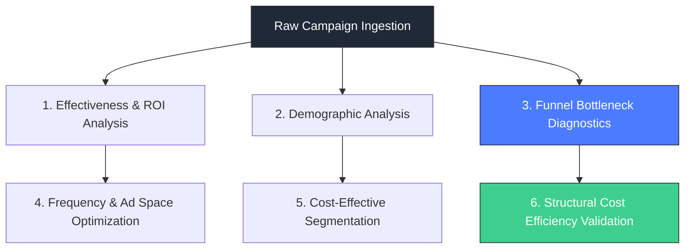

# 📈 Data-Driven Campaign Analysis: Funnel Conversion, Audience Segmentation, and Cost Efficiency

[](https://www.linkedin.com/in/wira-dhana-putra/)
[](https://medium.com/@wiradp)
[](https://wiradp.github.io/)

A structured marketing analytics and data science case study evaluating social media campaign performance. This project integrates statistical hypothesis testing, non-linear optimization patterns, and multi-stage funnel diagnostics to isolate cost-efficiency leaks and segment high-converting audience groups.

All findings are presented strictly as **associative insights** and empirical performance baselines rather than randomized or causal impact claims.

## 🌍 Project Portals
* **Live Analysis Journal:** [Read the full article on Medium](https://medium.com/@wiradp/data-driven-campaign-strategy-optimizing-funnel-conversion-and-targeting-for-maximum-roi-816fc1495810)
* **Interactive Code Workspace:** [View Notebook on Kaggle](https://www.kaggle.com/)

---

# 📌 Core Analytical Framework

The analysis is segmented into six descriptive domains to systematic dismantle performance bottlenecks:



### Key Statistical & Modeling Methods Implemented:

* **Linear Regression Modeling:** Quantifying budget elasticity and approved conversion variability.
* **Two-Sample Z-Tests:** Testing statistical variance of conversion rates across gender distributions.
* **Analysis of Variance (ANOVA):** Validating multi-group conversion significance across segmented age brackets.
* **Two-Sample T-Tests:** Executing A/B validation loops on isolated high-affinity interest groups.
* **Non-Linear Curve Diagnostics:** Mapping the point of diminishing returns between ad impression frequency and active user conversions.

---

# 📊 Core Analytical Insights & Ground Truths

### 1. Funnel Performance Bottlenecks

* **Top-of-Funnel Failure:** A severe drop-off is observed from Impressions to Clicks, yielding a baseline **Click-Through Rate (CTR) of just 0.018%**. This indicates critical gaps in either creative ad relevance or initial audience distribution parameters.
* **Mid-to-Bottom Drift:** **8.55%** of clicks generated a conversion action, while only **33.06%** of total conversions successfully passed back-end validation gates to become *Approved Conversions*.

### 2. Demographic & Interest Vectors

* **The Age Premium:** Age is identified as the single strongest demographic conversion predictor (Feature Importance: **0.2940**). The **30–34 cohort** represents the highest statistical conversion efficiency ($p = 0.0331$), whereas the 45–49 cohort underperforms.
* **Gender Invariance:** Gender variance yields no statistically significant difference in baseline conversion rates ($p = 0.3519$), neither as a standalone driver nor as an interaction effect with age.
* **A/B Testing Group (Interest 15 vs 20):** Group 15 generated a stronger descriptive acquisition value (Mean Total Conversion: 3.82 vs 2.63), but the hypothesis validation framework failed to reject the null hypothesis ($p = 0.395$, T-statistic: 0.86), confirming the variance remains within normal distribution limits.

### 3. Campaign & Cost Efficiency Profiles

* **Campaign A:** Identified as the most dominant asset across all structural cost layers, capturing the lowest relative Cost per Click (CPC), Cost per Conversion (CPConv), and final Cost per Approved Conversion (CPAConv) alongside the highest descriptive ROI (0.160).
* **Campaign C:** Represented the least efficient framework, displaying aggressive cost escalation, particularly when scaling volume within the female demographic and the 45–49 age cohort.

---

# 🏗️ Technical Architecture & Repository Layout

```text
campaign-funnel-analysis/
├── notebooks/
│   └── campaign_analytics_suite.ipynb  # Primary data processing & modeling script
├── data/
│   └── raw_campaign_metrics.csv        # 1,143 observations / 11 core variables
├── assets/
│   └── documentation/                  # Statistical distribution charts & heatmaps
├── requirements.txt                    # Compute environment dependencies
└── README.md                           # System documentation

```

### Core Variables Captured:

* `ad_id` / `fb_campaign_id` / `xyz_campaign_id`: Structural metadata layer trackers.
* `age` / `gender` / `interest`: Multidimensional audience demographic variables.
* `Impressions` / `Clicks` / `Spent`: Upper-funnel financial and visibility indicators.
* `Total_Conversion` / `Approved_Conversion`: Multi-stage target performance results.

---

# ⚙️ Execution & Computational Setup

To replicate the statistical models and pipeline execution blocks locally:

1. Clone the environment:

```bash
git clone <repository-url>
cd campaign-funnel-analysis

```

2. Establish runtime environment isolation:

```bash
python -m venv .venv
source .venv/bin/activate  # On Windows use: .venv\Scripts\activate

```

3. Initialize project dependencies:

```bash
python -m pip install --upgrade pip
python -m pip install -r requirements.txt

```

4. Launch the local compute workspace:

```bash
jupyter notebook notebooks/campaign_analytics_suite.ipynb

```

---

# 🔮 Strategic Data Recommendations

1. **Reallocate Capital Allocation:** Rechannel active ad spend from Campaign C into Campaign A's structural segments to exploit its proven lower acquisition cost dynamics.
2. **Amplify Micro-Targeting:** Restructure targeting parameters to prioritize the 30–34 age segment. Avoid expanding budget lines into high-frequency impressions for older brackets to mitigate ad fatigue.
3. **Execute Creative Optimization:** Prioritize resolving the top-of-funnel leak (0.018% CTR) by initiating aggressive A/B testing frameworks targeting ad layouts, core hooks, and copy architectures before increasing total spend.

---

# 👤 Author

**[Wira Dhana Putra](https://wiradp.github.io/)**

* Career Switcher → Pursuing professional engagements across Data Analytics, Applied Statistics, and Machine Learning.
* Core Pillars: Analytical Integrity, Rigorous Statistical Guardrails, and Explainable Insights.
---
